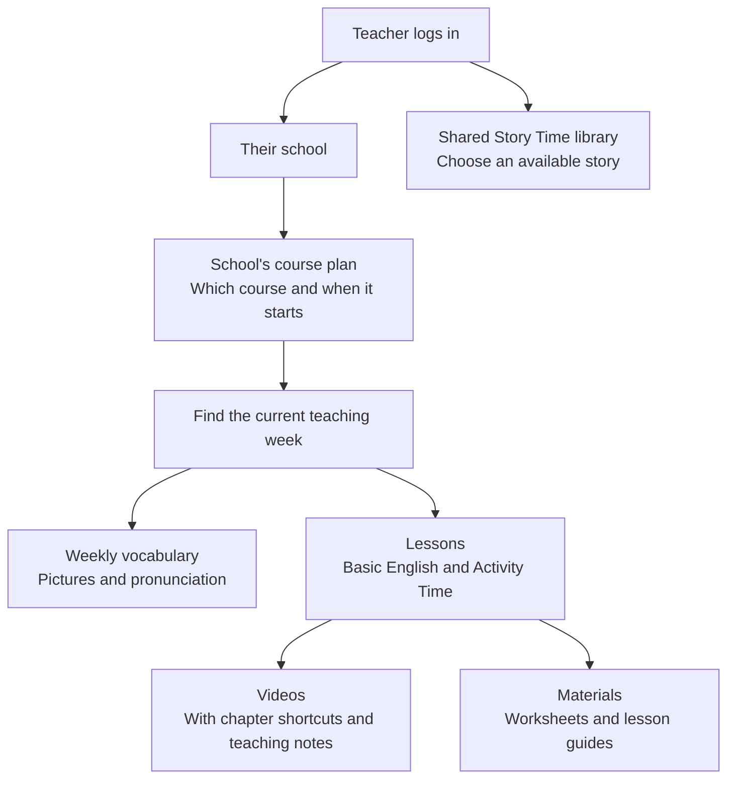
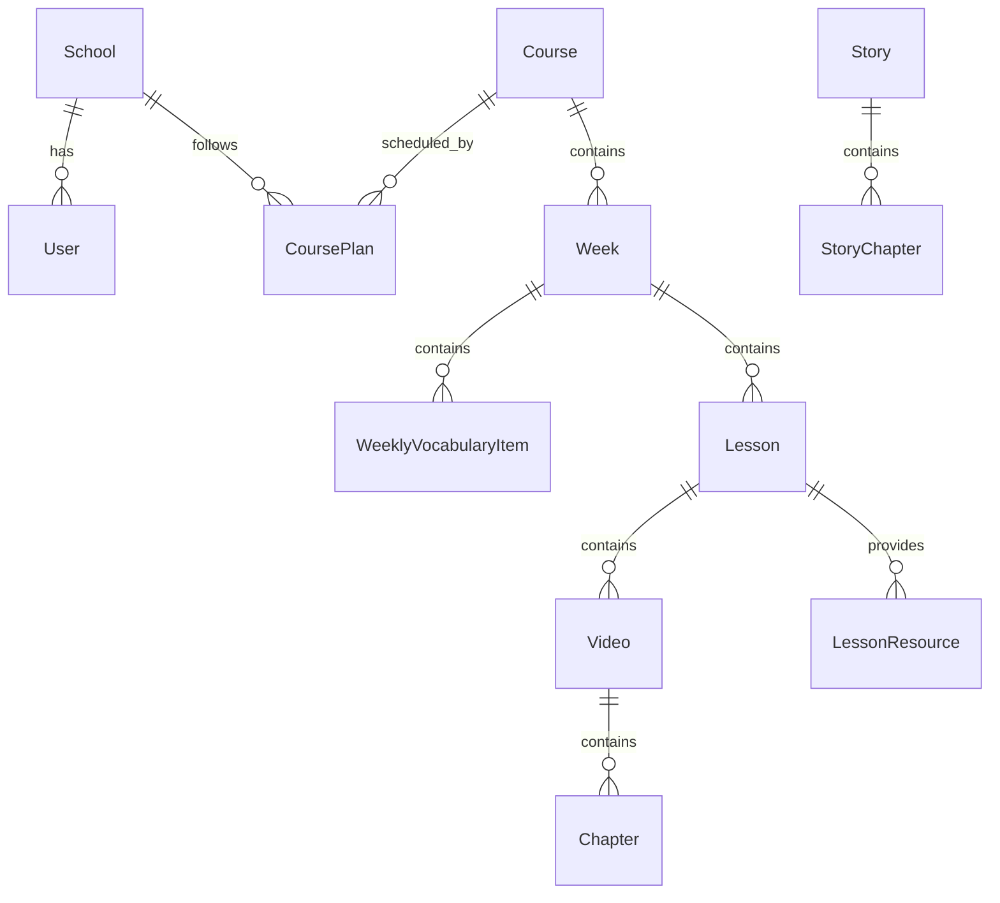
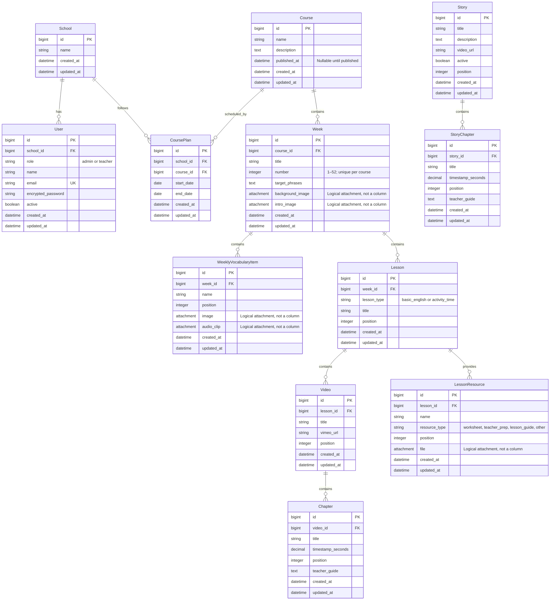

# AI Sensei Diagrams

## How AI Sensei organises teaching content

```mermaid
flowchart TD
    A["Teacher logs in"] --> B["Their school"]
    B --> C["School's course plan<br/>Which course and when it starts"]
    C --> D["Find the current teaching week"]
    D --> E["Weekly vocabulary<br/>Pictures and pronunciation"]
    D --> F["Lessons<br/>Basic English and Activity Time"]
    F --> G["Videos<br/>With chapter shortcuts and teaching notes"]
    F --> H["Materials<br/>Worksheets and lesson guides"]
    A --> I["Shared Story Time library<br/>Choose an available story"]
```

## Database relationships

```mermaid
erDiagram
    School ||--o{ User : has
    School ||--o{ CoursePlan : follows
    Course ||--o{ CoursePlan : scheduled_by
    Course ||--o{ Week : contains
    Week ||--o{ WeeklyVocabularyItem : contains
    Week ||--o{ Lesson : contains
    Lesson ||--o{ Video : contains
    Video ||--o{ Chapter : contains
    Lesson ||--o{ LessonResource : provides
    Story ||--o{ StoryChapter : contains
```

## Detailed database design

```mermaid
erDiagram
    School ||--o{ User : has
    School ||--o{ CoursePlan : follows
    Course ||--o{ CoursePlan : scheduled_by
    Course ||--o{ Week : contains
    Week ||--o{ WeeklyVocabularyItem : contains
    Week ||--o{ Lesson : contains
    Lesson ||--o{ Video : contains
    Video ||--o{ Chapter : contains
    Lesson ||--o{ LessonResource : provides
    Story ||--o{ StoryChapter : contains

    School {
        bigint id PK
        string name
        datetime created_at
        datetime updated_at
    }
    User {
        bigint id PK
        bigint school_id FK
        string role "admin or teacher"
        string name
        string email UK
        string encrypted_password
        boolean active
        datetime created_at
        datetime updated_at
    }
    Course {
        bigint id PK
        string name
        text description
        datetime published_at "Nullable until published"
        datetime created_at
        datetime updated_at
    }
    CoursePlan {
        bigint id PK
        bigint school_id FK
        bigint course_id FK
        date start_date
        date end_date
        datetime created_at
        datetime updated_at
    }
    Week {
        bigint id PK
        bigint course_id FK
        string title
        integer number "1–52; unique per course"
        text target_phrases
        attachment background_image "Logical attachment, not a column"
        attachment intro_image "Logical attachment, not a column"
        datetime created_at
        datetime updated_at
    }
    WeeklyVocabularyItem {
        bigint id PK
        bigint week_id FK
        string name
        integer position
        attachment image "Logical attachment, not a column"
        attachment audio_clip "Logical attachment, not a column"
        datetime created_at
        datetime updated_at
    }
    Lesson {
        bigint id PK
        bigint week_id FK
        string lesson_type "basic_english or activity_time"
        string title
        integer position
        datetime created_at
        datetime updated_at
    }
    Video {
        bigint id PK
        bigint lesson_id FK
        string title
        string vimeo_url
        integer position
        datetime created_at
        datetime updated_at
    }
    Chapter {
        bigint id PK
        bigint video_id FK
        string title
        decimal timestamp_seconds
        integer position
        text teacher_guide
        datetime created_at
        datetime updated_at
    }
    LessonResource {
        bigint id PK
        bigint lesson_id FK
        string name
        string resource_type "worksheet, teacher_prep, lesson_guide, other"
        integer position
        attachment file "Logical attachment, not a column"
        datetime created_at
        datetime updated_at
    }
    Story {
        bigint id PK
        string title
        text description
        string video_url
        boolean active
        integer position
        datetime created_at
        datetime updated_at
    }
    StoryChapter {
        bigint id PK
        bigint story_id FK
        string title
        decimal timestamp_seconds
        integer position
        text teacher_guide
        datetime created_at
        datetime updated_at
    }
```
