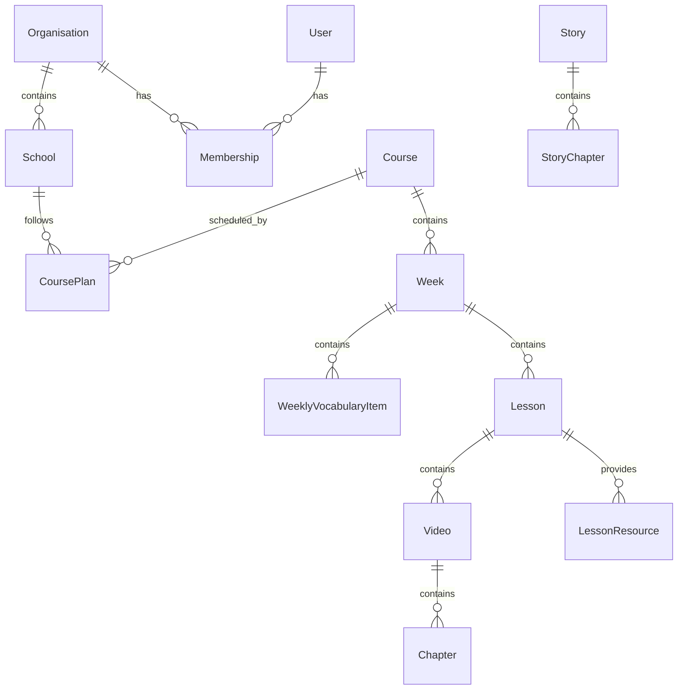

# General Database Construction Notes

## Database Diagram

**Design decision still open**

---

## Core Structure

Organisation
└── Schools
└── Course Plans
└── Course
└── Weeks
├── Weekly Vocabulary
└── Lessons

Story Time exists separately as a shared library.

---

## Organisation

The customer/company.

### Fields

- id
- name

### Relationships

- has many schools
- has many users through memberships

---

## School

An individual school/location.

Each school can independently follow a Course Plan even if multiple
schools belong to the same Organisation.

### Fields

- id
- organisation_id
- name
- active

### Relationships

- belongs to organisation
- has many course plans

---

## User

### Fields

- id
- name
- email
- password
- active

### Relationships

- belongs to organisations through memberships

---

## Membership

Connects Users to Organisations and defines their role.

### Fields

- id
- user_id
- organisation_id
- role

Possible roles:

- admin
- teacher

---

## Course

Represents a complete course/curriculum.

### Fields

- id
- name
- description
- published_at

### Relationships

- has many weeks

---

## Course Plan

Defines which Course a School is following and when.

### Fields

- id
- school_id
- course_id
- start_date
- end_date

### Relationships

- belongs to school
- belongs to course

Potential future improvement:
Use explicit plan/week dates rather than calculating everything from
start_date so holidays and skipped weeks can be supported.

---

## Week

Represents one week of Course content.

### Fields

- id
- course_id
- title
- position
- target_phrases
- background_image
- intro_image

### Relationships

- belongs to course
- has many lessons
- has many weekly vocabulary items

The Teacher UI should automatically know the week based on the plan.

Teachers can also navigate to previous/next Weeks.

---

## Weekly Vocabulary Item

Represents vocabulary available during a Week.

For MVP, vocabulary should appear as a reusable tray/panel rather than
being embedded as clickable areas in the background image.

Example Teacher UI:

[ Vocabulary ]

→ Opens:

[ Apple ] [ Banana ] [ Book ] [ Chair ]

Each item can be tapped to play its English pronunciation.

### Fields

- id
- week_id
- name
- position

### Attachments

- image
- audio_clip

### Relationships

- belongs to week

Potential future fields:

- display_text
- translation
- phonetic_text

---

## Weekly Vocabulary UI

For MVP:

- Teacher can open a Vocabulary panel/tray from the Week/Lesson view.
- Vocabulary items display as large image cards.
- Tapping a card plays the attached English audio clip.
- Cards should be large and tablet-friendly.
- Vocabulary order should be configurable by Admin.
- Tray should be easy to open and dismiss during a lesson.

This avoids requiring Admin users to position clickable elements on
each background image.

---

## Lesson

Represents a lesson contained within a Week.

### Fields

- id
- week_id
- lesson_type
- title
- position

### Lesson Types

- Basic English
- Activity Time

Story Time should not initially be treated as a normal weekly Lesson
because it comes from a shared library.

### Relationships

- belongs to week
- has many videos
- has many resources

---

## Video

Represents a playable video within a Lesson.

Basic English may have one main video.

Activity Time may have multiple videos, currently planned as roughly
three.

### Fields

- id
- lesson_id
- title
- vimeo_url / vimeo_id
- position

### Relationships

- belongs to lesson
- has many chapters

---

## Chapter

Represents a manually defined section/timestamp within a Video.

Used for:

- chapter forward/back controls
- displaying current chapter
- potentially changing the Teacher Guide based on playback position

### Fields

- id
- video_id
- title
- timestamp_seconds
- position
- teacher_guide

### Relationships

- belongs to video

Potential future functionality:
The Video Player can determine the current chapter based on playback
time and automatically display the relevant Teacher Guide.

---

## Lesson Resource

Represents downloadable/viewable Lesson materials.

### Fields

- id
- lesson_id
- name
- resource_type
- position

### Attachment

- file

### Resource Types

- worksheet
- teacher_prep
- lesson_guide
- other

### Relationships

- belongs to lesson

---

## Story

Story Time should initially exist as a shared content library rather
than being assigned separately to every Week.

Teachers can open Story Time and select from the currently available
stories.

### Fields

- id
- title
- description
- video_url / vimeo_id
- active
- position

Potential relationships:

- has many story chapters

---

## Story Chapter

Optional depending on Story Time requirements.

### Fields

- id
- story_id
- title
- timestamp_seconds
- position
- teacher_guide

---

# Approximate Model Relationships

Organisation
├── Memberships
│ └── Users
│
└── Schools
└── Course Plans
└── Course
└── Weeks
├── Weekly Vocabulary Items
│ ├── Image
│ └── Audio Clip
│
└── Lessons
├── Videos
│ └── Chapters
│
└── Lesson Resources

Separate shared library:

Stories
└── Story Chapters

Future:

Week
└── Hotspots
└── Weekly Vocabulary Item

---

# Specific rails structure for DB

## Organisation

has_many :schools
has_many :users

Fields:

- name

---

## School

belongs_to :organisation
has_many :course_plans

Fields:

- name
- active

---

## User

belongs_to :organisation

Fields:

- name
- email
- encrypted_password
- role
- active

Roles:

- admin
- teacher

---

## Course

has_many :weeks

Fields:

- name
- description
- published_at

---

## Week

belongs_to :course
has_many :lessons
has_many :weekly_vocabulary_items

Fields:

- title
- position
- target_phrases

Attachments:

- background_image
- intro_image

---

## CoursePlan

belongs_to :school
belongs_to :course

Fields:

- start_date
- end_date

---

## Lesson

belongs_to :week
has_many :videos
has_many :lesson_resources

Fields:

- lesson_type
- title
- position

Lesson types:

- basic_english
- activity_time

---

## Video

belongs_to :lesson
has_many :chapters

Fields:

- title
- vimeo_url
- position

---

## Chapter

belongs_to :video

Fields:

- title
- timestamp_seconds
- teacher_guide
- position

---

## LessonResource

belongs_to :lesson

Fields:

- name
- resource_type
- position

Attachment:

- file

Resource types:

- worksheet
- teacher_prep
- lesson_guide
- other

---

## WeeklyVocabularyItem

belongs_to :week

Fields:

- name
- position

Attachments:

- image
- audio_clip

---

## Story

has_many :story_chapters

Fields:

- title
- description
- video_url
- active
- position

---

## StoryChapter

belongs_to :story

Fields:

- title
- timestamp_seconds
- teacher_guide
- position
