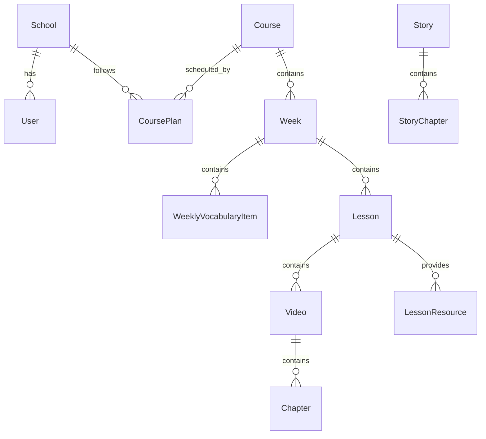
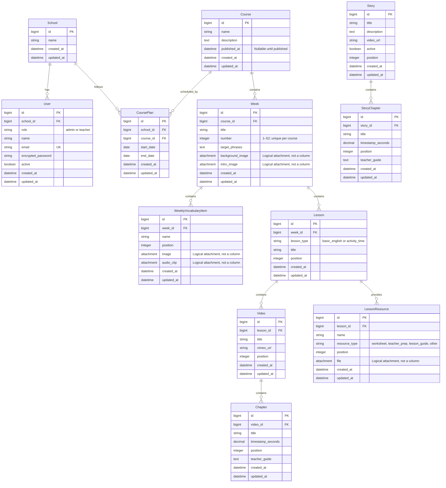

# General Database Construction Notes

## Database Diagram

```mermaid
erDiagram
    School ||--o{ User : has
    School ||--o{ CoursePlan : follows
    Course ||--o{ CoursePlan : scheduled_by
    Course ||--o{ Week : contains
    Week ||--o{ WeeklyVocabularyItem : contains
    Week ||--o{ Lesson : contains
    Lesson ||--o{ Video : contains
    Video ||--o{ Chapter : contains
    Lesson ||--o{ LessonResource : provides
    Story ||--o{ StoryChapter : contains
```

**School decision:** each user belongs to exactly one school.
School is the only school/account grouping; there is no Organisation model.
Store `school_id` and `role` on User; no Membership model is needed.
Course Plans belong directly to School. Different curriculum setups
use separate schools and separate logins, not account switching.

Related: [Styling](AI-Sensei-Styling.md) · [Infrastructure](AI-Sensei-Infra.md)

---

## Core Structure

School
└── Course Plans
└── Course
└── Weeks
├── Weekly Vocabulary
└── Lessons

Story Time exists separately as a shared library.

---

## School

Represents a school and its curriculum setup. Create separate schools
and separate user accounts for schools or setups following different curricula.
There is no parent organisation layer in this design.

### Fields

- id
- name

### Relationships

- has many course plans
- has many users

---

## User

Each user belongs to exactly one school. Access to another
school requires a separate login/account. With globally unique email
addresses, those accounts need distinct email addresses (or email aliases).

### Fields

- id
- school_id
- name
- email
- encrypted_password (Devise; never store plaintext passwords)
- role
- active

### Relationships

- belongs to school

Possible roles:

- admin
- teacher

Roles are stored on User. Teacher access is scoped to their school
and its Course Plans through `User.school_id`; no assignment join model is needed. Whether admins
can manage other schools still needs an explicit authorization decision.

---

## Course

Represents a complete course/curriculum.

### Fields

- id
- name
- description
- published_at

### Relationships

- has many weeks

---

## Course Plan

Defines which Course a School is following and when.

### Fields

- id
- school_id
- course_id
- start_date
- end_date

### Relationships

- belongs to school
- belongs to course

Potential future improvement:
Use explicit plan/week dates rather than calculating everything from
start_date so holidays and skipped weeks can be supported.

---

## Week

Represents one numbered week of Course content.

`number` is an integer from 1–52, unique within its course. It identifies
a curriculum week, not an ISO calendar week. A Rails week enum is unnecessary;
use a shared `WEEK_NUMBERS = (1..52).freeze` range for validation and selectors.
The same course content can be reused by Course Plans in different years.

### Fields

- id
- course_id
- title
- number
- target_phrases
- background_image
- intro_image

### Relationships

- belongs to course
- has many lessons
- has many weekly vocabulary items

The Teacher UI should automatically know the week based on the plan.

Teachers can also navigate to previous/next Weeks.

For the initial consecutive-week schedule, a week's date range starts at
`CoursePlan.start_date + (Week.number - 1) * 7 days` and covers seven days,
limited by the plan's end date when present. The start date anchors Week 1;
a new calendar year does not reset the curriculum week number. Holidays and
skipped weeks would require the explicit plan/week dates described above.

Require an integer `number` in 1–52 and retain a unique database index on
`(course_id, number)`, with matching model validation and a range check.
This only prevents duplicate Week containers; it does not limit lesson counts.

### Week lookup and helpers

- Build selector labels such as "Week 1" from the shared 1–52 range.
- Calculate the course week as `((date - plan.start_date).to_i / 7) + 1`,
  using date values in the application's time zone.
- Return no current week outside the plan dates or the 1–52 range; do not
  wrap or clamp the result into another week.
- Find the Week by the plan's `course_id` and calculated `number`, then load
  all its lessons ordered by `position`. A missing Week returns no content.
- Read a lesson's week number through `lesson.week.number`; avoid storing
  the same number on Lesson as well.

This follows Hub's numbered curriculum weeks. Hub validates an integer
`CourseLesson.week` from 1–52; its `day` field is an enum. Its `Courseable`
concern calculates weeks relative to a plan's start date. AI Sensei keeps
its separate Week model because vocabulary and other content belong to it.

Source: [Hub CourseLesson](../kidsupIT/vision-up-hub/app/models/course_lesson.rb)
and [Courseable](../kidsupIT/vision-up-hub/app/models/concerns/courseable.rb).
A 52-week curriculum is not the same as every calendar week in a year;
calendar years can include an ISO week 53. Calendar-year scheduling would
need a separate decision.

---

## Weekly Vocabulary Item

Represents vocabulary available during a Week.

For MVP, vocabulary should appear as a reusable tray/panel rather than
being embedded as clickable areas in the background image.

Example Teacher UI:

[ Vocabulary ]

→ Opens:

[ Apple ] [ Banana ] [ Book ] [ Chair ]

Each item can be tapped to play its English pronunciation.

### Fields

- id
- week_id
- name
- position

### Attachments

- image
- audio_clip

### Relationships

- belongs to week

Potential future fields:

- display_text
- translation
- phonetic_text

---

## Weekly Vocabulary UI

For MVP:

- Teacher can open a Vocabulary panel/tray from the Week/Lesson view.
- Vocabulary items display as large image cards.
- Tapping a card plays the attached English audio clip.
- Cards should be large and tablet-friendly.
- Vocabulary order should be configurable by Admin.
- Tray should be easy to open and dismiss during a lesson.

This avoids requiring Admin users to position clickable elements on
each background image.

---

## Lesson

Represents a lesson contained within a Week.

A week can contain multiple lessons of the same type, including multiple
Activity Time lessons. Do not impose a unique constraint on
`(week_id, lesson_type)` or require exactly one of each type for publication.

`week_id` identifies the Week container, and `lesson_type` categorises the
lesson. Require a valid lesson type, but allow it to repeat within a week.
`position` controls display order. The weekly view loads all matching lessons;
these records describe content rather than unique per-date bookings.

### Fields

- id
- week_id
- lesson_type
- title
- position

### Lesson Types

- Basic English
- Activity Time

Story Time should not initially be treated as a normal weekly Lesson
because it comes from a shared library.

### Relationships

- belongs to week
- has many videos
- has many resources

---

## Video

Represents a playable video within a Lesson.

Basic English may have one main video.

Activity Time may have multiple videos, currently planned as roughly
three.

### Fields

- id
- lesson_id
- title
- vimeo_url / vimeo_id
- position

### Relationships

- belongs to lesson
- has many chapters

---

## Chapter

Represents a manually defined section/timestamp within a Video.

Used for:

- chapter forward/back controls
- displaying current chapter
- potentially changing the Teacher Guide based on playback position

### Fields

- id
- video_id
- title
- timestamp_seconds
- position
- teacher_guide

### Relationships

- belongs to video

Potential future functionality:
The Video Player can determine the current chapter based on playback
time and automatically display the relevant Teacher Guide.

---

## Lesson Resource

Represents downloadable/viewable Lesson materials.

### Fields

- id
- lesson_id
- name
- resource_type
- position

### Attachment

- file

### Resource Types

- worksheet
- teacher_prep
- lesson_guide
- other

### Relationships

- belongs to lesson

---

## Story

Story Time should initially exist as a shared content library rather
than being assigned separately to every Week.

Teachers can open Story Time and select from the currently available
stories.

### Fields

- id
- title
- description
- video_url / vimeo_id
- active
- position

Potential relationships:

- has many story chapters

---

## Story Chapter

Optional depending on Story Time requirements.

### Fields

- id
- story_id
- title
- timestamp_seconds
- position
- teacher_guide

---

# Approximate Model Relationships

School
├── Users
│
└── Course Plans
└── Course
└── Weeks
├── Weekly Vocabulary Items
│ ├── Image
│ └── Audio Clip
│
└── Lessons
├── Videos
│ └── Chapters
│
└── Lesson Resources

Separate shared library:

Stories
└── Story Chapters

Future:

Week
└── Hotspots
└── Weekly Vocabulary Item

---

# Specific rails structure for DB

## School

has_many :course_plans
has_many :users

Fields:

- name

---

## User

belongs_to :school

Fields:

- school_id
- name
- email
- encrypted_password
- role
- active

Roles:

- admin
- teacher

---

## Course

has_many :weeks

Fields:

- name
- description
- published_at

---

## Week

belongs_to :course
has_many :lessons
has_many :weekly_vocabulary_items

Require an integer `number` from 1–52, unique within `course_id`, backed by
a composite unique database index. Use the shared range for selectors/helpers.

Fields:

- title
- number
- target_phrases

Attachments:

- background_image
- intro_image

---

## CoursePlan

belongs_to :school
belongs_to :course

Fields:

- start_date
- end_date

---

## Lesson

belongs_to :week
has_many :videos
has_many :lesson_resources

Require a valid `lesson_type`; repeated types in the same week are allowed.
Use the existing `week_id` association for week lookup, without a week enum.

Fields:

- lesson_type
- title
- position

Lesson types:

- basic_english
- activity_time

---

## Video

belongs_to :lesson
has_many :chapters

Fields:

- title
- vimeo_url
- position

---

## Chapter

belongs_to :video

Fields:

- title
- timestamp_seconds
- teacher_guide
- position

---

## LessonResource

belongs_to :lesson

Fields:

- name
- resource_type
- position

Attachment:

- file

Resource types:

- worksheet
- teacher_prep
- lesson_guide
- other

---

## WeeklyVocabularyItem

belongs_to :week

Fields:

- name
- position

Attachments:

- image
- audio_clip

---

## Story

has_many :story_chapters

Fields:

- title
- description
- video_url
- active
- position

---

## StoryChapter

belongs_to :story

Fields:

- title
- timestamp_seconds
- teacher_guide
- position

---

## Detailed Database Diagram

Draft application schema with proposed data types. `PK` means primary key,
`FK` means foreign key, and `UK` means unique key. Each child belongs to
exactly one parent; a parent can have zero or more children.

Each user belongs to exactly one school through `User.school_id`.
The user role is stored on User, consistently with the Rails notes above.

```mermaid
erDiagram
    School ||--o{ User : has
    School ||--o{ CoursePlan : follows
    Course ||--o{ CoursePlan : scheduled_by
    Course ||--o{ Week : contains
    Week ||--o{ WeeklyVocabularyItem : contains
    Week ||--o{ Lesson : contains
    Lesson ||--o{ Video : contains
    Video ||--o{ Chapter : contains
    Lesson ||--o{ LessonResource : provides
    Story ||--o{ StoryChapter : contains

    School {
        bigint id PK
        string name
        datetime created_at
        datetime updated_at
    }
    User {
        bigint id PK
        bigint school_id FK
        string role "admin or teacher"
        string name
        string email UK
        string encrypted_password
        boolean active
        datetime created_at
        datetime updated_at
    }
    Course {
        bigint id PK
        string name
        text description
        datetime published_at "Nullable until published"
        datetime created_at
        datetime updated_at
    }
    CoursePlan {
        bigint id PK
        bigint school_id FK
        bigint course_id FK
        date start_date
        date end_date
        datetime created_at
        datetime updated_at
    }
    Week {
        bigint id PK
        bigint course_id FK
        string title
        integer number "1–52; unique per course"
        text target_phrases
        attachment background_image "Logical attachment, not a column"
        attachment intro_image "Logical attachment, not a column"
        datetime created_at
        datetime updated_at
    }
    WeeklyVocabularyItem {
        bigint id PK
        bigint week_id FK
        string name
        integer position
        attachment image "Logical attachment, not a column"
        attachment audio_clip "Logical attachment, not a column"
        datetime created_at
        datetime updated_at
    }
    Lesson {
        bigint id PK
        bigint week_id FK
        string lesson_type "basic_english or activity_time"
        string title
        integer position
        datetime created_at
        datetime updated_at
    }
    Video {
        bigint id PK
        bigint lesson_id FK
        string title
        string vimeo_url
        integer position
        datetime created_at
        datetime updated_at
    }
    Chapter {
        bigint id PK
        bigint video_id FK
        string title
        decimal timestamp_seconds
        integer position
        text teacher_guide
        datetime created_at
        datetime updated_at
    }
    LessonResource {
        bigint id PK
        bigint lesson_id FK
        string name
        string resource_type "worksheet, teacher_prep, lesson_guide, other"
        integer position
        attachment file "Logical attachment, not a column"
        datetime created_at
        datetime updated_at
    }
    Story {
        bigint id PK
        string title
        text description
        string video_url
        boolean active
        integer position
        datetime created_at
        datetime updated_at
    }
    StoryChapter {
        bigint id PK
        bigint story_id FK
        string title
        decimal timestamp_seconds
        integer position
        text teacher_guide
        datetime created_at
        datetime updated_at
    }
```

### Proposed constraints and implementation choices

- IDs use `bigint`; `created_at` and `updated_at` are proposed Rails timestamps
  on every table. Types are design suggestions, not final migrations.
- Every foreign key shown should be required, indexed, and enforced by a
  database foreign key constraint. Deletion behaviour still needs deciding.
- `User.email` should be required and unique, with consistent case
  normalisation. `encrypted_password` represents the stored password hash,
  following the Rails notes; plaintext passwords are not stored.
- `User.school_id` is required and indexed, but not unique: many users
  can belong to the same school. Each user has one role.
- `role`, `lesson_type`, and `resource_type` should be restricted to the
  values shown in the diagram.
- `Week.number` is required, an integer in 1–52, and unique within its course:
  composite unique index on `(course_id, number)` and a range check. This
  identifies the Week container without restricting the lessons inside it.
- `Lesson.lesson_type` is required and restricted to the allowed values,
  but is not unique within a week. Multiple activities in one week are valid.
  No exactly-one-of-each-type publication rule is proposed.
- `position` fields order records within their parent; Story positions order
  the shared library. Position uniqueness is not assumed.
- Chapter timestamps should be non-negative. Decimal seconds allow fractional
  timestamps; precision and scale remain to be chosen.
- Course Plan dates should satisfy `end_date >= start_date` when both are
  present. Whether end dates are required and whether plans can overlap
  within the same school remain open decisions.
- Attachment rows describe model attachments, not SQL columns. If Rails
  Active Storage is chosen, its supporting tables hold attachment metadata;
  those framework tables are outside this application diagram.
- URLs are used for Video and Story instead of separate Vimeo IDs, following
  the Rails notes. `target_phrases` is provisionally text.
- Story Chapters remain optional as a feature. Future vocabulary fields,
  Hotspots, explicit plan/week dates, and authentication framework support
  fields are not part of this draft.
- Required fields beyond IDs, foreign keys, email, `Week.number`, and
  `Lesson.lesson_type`, along with defaults
  for active flags and other fields, still need to be specified.
