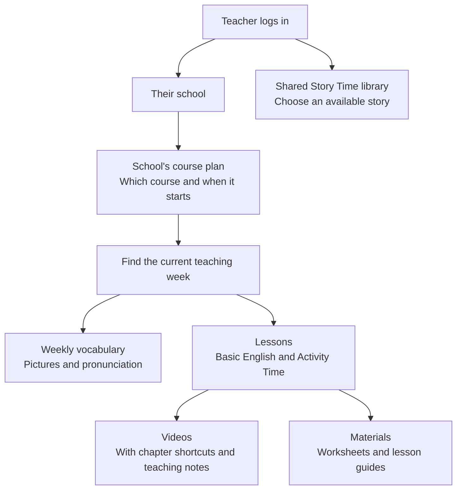

# My own scratchpad for things I complete through the day, so that I can refer to it during daily reports.

## This may or may not get used every day, but when something is small I will throw it in here.

### 29/09

- Added a plain-language overview of the AI Sensei database design for explaining how teaching content is organised to nontechnical colleagues.

#### How AI Sensei organises teaching content

Each school has a plan that selects a course and its start date. That tells the system which week's lessons and vocabulary to show teachers. Lessons contain videos and materials. Story Time is a separate shared library.

Schools can use the same course but start on different dates. The course holds the teaching content; each school's course plan sets its schedule.

See the [database design notes](./AI-sensei-DB.md) for the technical details.

### 24/09

- Added edits to the company site to fix some title issues as well as add some spacing differences.
- Created the Minami Senju landing page for advertisements in the future
- Changed some Minami Senju school information related to school drop off points, as well as the proper pin to the map that is on the school page.
- Added styling foundations, pulling specifically from the basics used in vision up as we will also be utilizing tailwind 3.8
- Added devise for authentication, created basic user models and testing.

### 17/09

- Formalize all architecture information for figgny and finish the azure/apple setups.
- Test prototype in preparation for meeting
- Meeting to show prototype and decide on the future of the ai sensei product
- Speak with mizutani about ai related handover, spoke with him about the tools he is using and took over the accounts for the app, later spoke to Junya regarding the fact that this code is a nice example of some things but won't be overly useful and we can cancel the subscription to replit.

### 16/09

- Luis was having some issues with vision up hub's category resource and phonics resource displays, I spoke with him about the best way to have it sorted and implemented a fix.
- Showed the ai sensei layout to mike and made agreements on what would be best to go through during tomorrow's meeting.

### 10/09

- Created basic database layout for AI sensei.
- formalize database based on feedback and use mermaid to create diagrams
- Run testing for vimeo links showing properly to the delevision and hte remote working properly.
- MTG about ai sensei, showing proof of concept for pure screen share.
- Create new ai project repo
- Create base project files for AI sensei as well as work through which code versions should be use
- Create documentation for Infra/mvps/database concepts related to AI sensei and uploaded my decisions to wiki.kids-up.app as documentation
- Change Jack images on the main website with new updated images using different teacher faces.

### 17/08

- Get Daily sheet for Paolo, got the specific sheet from SS and made the conversions needed for paolo to update it.
- Follow up with Yamamoto regarding cloudlfare, created a permissions account for him and invited him to the current project, from here he is set to attempt to integrade kids-up.jp into our cloudflare so that we can both be responsible for the domains we control under kidsup.
- Inspect fault logs after the week off, turns out there was some crashing happening last night, which was the result of updates being needed. I updated two packages and deployed to vision.
- Worked through the suggested changes for the halloween LP and deployed them to production, afterwards I provided the link to Abe so that he could make and further considerations for changes before our friday release.
- Responded to seasonal chats and fixed any issues happening regarding invoices etc.

### 19/08

- Worked through the changes in halloween chat and applied them, with additional styling changes in some other areas
- Reviewed the current Onamae / Cloudflare setup and permissions to confirm whether Yamamoto can realistically bring kids-up.jp into Cloudflare without needing further access changes.
- Worked on the RPA CSV workflow, looking at how to handle the download → encoding conversion → split → sequential upload process more reliably.
- Added script automation around the .jp deployment flow to address some issues in the existing CI/CD process.

tomorrow: health check, meeting with Leroy as i'm in the office, rashimba accounts setup assuming the email is prepared.

### 20/08

- Went to the health check at Shibuya after arriving at the Yotsuya office.
- Talks with Leroy regarding ongoing tasks and what I'll take over, not an official meeting time but various conversations through the day, particularly figuring out the new mailing system and what parts I would need to handle regarding this.
- extract data for hitomi for use in the next meeting related to how many students are signing up for extensions
- confer with daniel regarding many new changes to the hub, including events changes, analytics and rejigging the tests page from the teacher's pov
- Work on hub related tasks, I began some massive transitions to how we use files on the application, I had created the new system, but after talking to daniel there were some new ideas and I've begun working on those.

### 21/08

- [x]retrieve banners from alex and set the page for halloween party
- [x]deploy halloween LP
- Set halloween banners on the seasonal website
- [x]Finalize full migrations for the HUB site. All tutorials have had migrations created so that it can seemlessly form into the new system. Once this is set and applied properly teachers can hopefully use this tutorial/resource section as a replacement to needing drive folders.
- Scraped the Japanese GP sites to rotate the information for the racer's recent results.

### 26/08

- Adjusted setsu calendar to show form the month where there are actually open setsus available
- Mobile edits for the content in the newsletter
- Daniel laundry list

### 27/08

- Adjusted newsletter based on japanese feedback
- Added analytics to the vision up hub, including comprehensive analytics for tests, such as school vs average scores, when each school is moving up and how long that has taken
- edit setsu calendar to go toward the next month if there are no setsumeikais open on the current month

- Add the same for events, lessons can be bundled in this case.
- analytics data as a csv, and potential analytics page
- tests page for teachers should have stuff for visibility

- [x]nakameguro landing
- [x]most is template new school landing, the start is code put in as a wordpress page
- [x]under pages name permalink to check which one it is.
- [x]theres a specific css page for setsu and new cshool pages cuz theres another set pages that maybe
- [x]REMOVE JACK
- [x]pieces are in custom-page-parts/setsu etc
- [x]we need to update the race results

- If I link something from vision-up.app and that person clicks it from hub.kids-up.app we want them to still login or something, rather than whatever current interaction takes place
